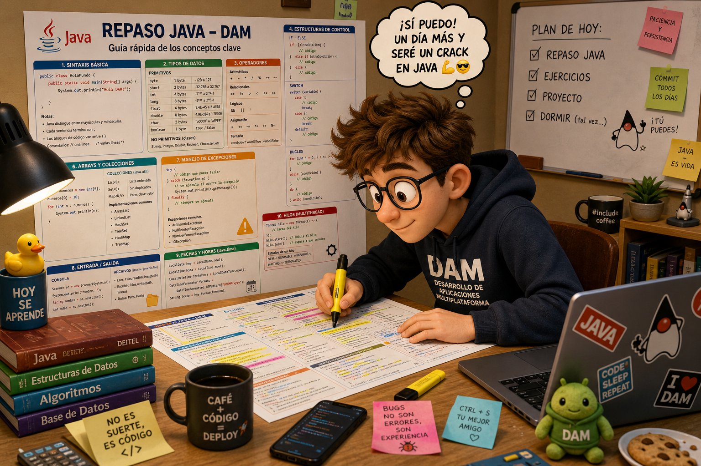
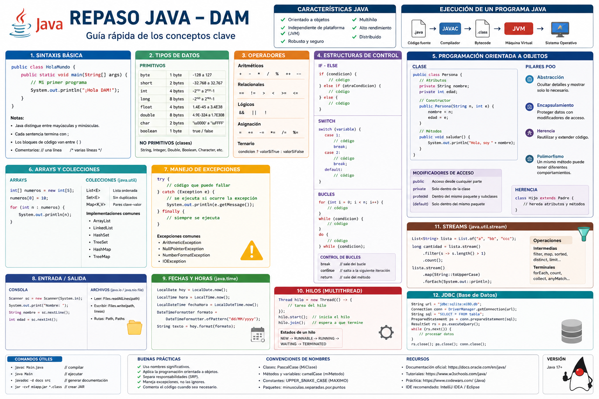

<div align="justify;">

# Java por bloques 


<p align="center">
  
</p>

##  Objetivo

Trabajar y repasar los conceptos generales que se han desarrollado dutante el curso:

- Algoritmos
- Estructuras de datos
- Programación orientada a objetos
- Persistencia
- Validación de datos
- Documentación profesional

> Cada bloque se evalúa de forma independiente.

---

## Enfoque 

Este proyecto no consiste solo en “hacer que funcione”.

Debes demostrar:

✔ Comprensión de algoritmos  
✔ Uso correcto de estructuras de datos  
✔ Código limpio y validado  
✔ Documentación técnica profesional  

---

## Estructura del proyecto

```text
com.docencia.colecciones
com.docencia.condicionales
com.docencia.algoritmos
com.docencia.cadenas
com.docencia.numeros
com.docencia.herencia
com.docencia.fechas
com.docencia.regex
com.docencia.ficheros
com.docencia.sqlite
```

---

## Qué tienes que hacer

Implementar todos los métodos que contienen:

```java
throw new UnsupportedOperationException("Mensaje descriptivo del algoritmo");
```

❗ No modificar:
- nombres de métodos
- firmas
- interfaces

---

## Evaluación

| Parte | Peso |
|------|------|
| Tests | 8 |
| Documentación | 2 |

> Se trata de que seas pasas de comprender los test, resolver los ejercios y documentar las api´s **interfaces** siguiendo los patrónes que hemos trabajado en clase.

---

## Vamos algunos bloques y servicios

---

### 1. COLECCIONES

####  ListService

##### filtrarPalabrasPorLongitud
Filtra palabras por longitud mínima.

Algoritmo:
- Recorrer lista
- Evaluar longitud
- Construir nueva lista

---

##### ordenarNumerosAscendente
Ordena números de menor a mayor.

Algoritmo:
- Comparación entre elementos
- Intercambio (burbuja o sort)

---

##### calcularMediaLista
Calcula media aritmética.

Algoritmo:
- Sumar valores
- Dividir entre tamaño

---

####  SetService

##### obtenerElementosUnicos
Elimina duplicados.

Algoritmo:
- Conversión a Set

---

##### intersectarConjuntos
Obtiene elementos comunes.

Algoritmo:
- Retener coincidencias

---

####  MapService

#### contarFrecuenciaPalabras
Cuenta repeticiones.

Algoritmo:
- Map con acumulador

---

##### obtenerClaveConMayorValor
Devuelve clave con mayor valor.

Algoritmo:
- Recorrer mapa
- Comparar valores

---

###  2. CONDICIONALES

####  IfElseService

##### clasificarEdad
Clasifica por rango.

Algoritmo:
- if / else

---

####  SwitchService

#### obtenerNombreDia
Devuelve nombre del día.

Algoritmo:
- switch por número

---

###  3. ALGORITMOS

####  BusquedaService

##### buscarIndiceElemento
Búsqueda lineal.

---

##### encontrarMaximo
Comparación secuencial.

---

####  OrdenacionService

##### ordenarBurbujaAscendente
Ordenación burbuja.

Algoritmo:
- Comparar pares
- Intercambiar

---

###  4. CADENAS

####  StringService

##### esPalindromo
Comprueba si es palíndromo.

Algoritmo:
- Limpiar texto
- Invertir
- Comparar

---

##### contarVocales
Cuenta vocales.

Algoritmo:
- Recorrer texto

---

###  5. NÚMEROS

####  IntegerService

##### esNumeroPrimo
Algoritmo:
- Divisibilidad hasta raíz

---

##### calcularFactorial
Algoritmo:
- Multiplicación iterativa

---

####  MathService

##### calcularAreaCirculo
Fórmula:
π * r²

---

###  6. HERENCIA

Conceptos:

- Clase abstracta
- Herencia
- instanceof

---

###  7. FECHAS

### 📌 LocalDateService

##### calcularEdad
Algoritmo:
- Period.between

---

###  8. REGEX

Validaciones:

- DNI
- Email
- Teléfono

---

###  9. FICHEROS

####  CsvService

#### leerRegistrosCsv
Algoritmo:
- Leer líneas
- split(",")

---

###  10. SQLITE

####  ClienteDbService

##### create
Algoritmo:
- Validar datos
- Insertar

---

##  DOCUMENTACIÓN OBLIGATORIA

```java
/**
 * Explica qué hace el método.
 *
 * @param parametro descripción
 * @return resultado
 * @throws IllegalArgumentException si error
 */
```

---

<p align="center">
  
</p>

##  Objetivo final

✔ Tests en verde  
✔ Código correcto  
✔ Algoritmos bien aplicados  
✔ Documentación completa  

---

##  Consejos

1. Haz pasar tests (8 puntos)
2. Mejora documentación (2 puntos)

---

</div>
