# Práctica 01

<hr>

## Índice de Contenidos
<details><summary><b>Ver índice</b></summary>

- [Práctica 01](#práctica-01)
    - [03 - Maven y construcción de proyectos en Java](#03---maven-y-construcción-de-proyectos-en-java)
        - [Introducción](#introducción)
        - [Primeros pasos](#primeros-pasos)
        - [Creación del proyecto](#creación-del-proyecto)
    - [04 - Compilar y entender archivos](#04---compilar-y-entender-archivos)
    - [05 - Ciclos de vida, fases y goals](#05---ciclos-de-vida-fases-y-goals)
        - [Identificar entorno](#identificar-entorno)
    - [06 - Añadir y utilizar una dependencia](#06---añadir-y-utilizar-una-dependencia)
    - [07 - Maven central y repo local](#07---maven-central-y-repo-local)
    - [08 - Repositorios externos y settings.xml](#08---repositorios-externos-y-settingsxml)
    - [09 - Repositorios privados, mirrors y proxy](#09---repositorios-privados-mirrors-y-proxy)
    - [10 - Profiles: activar configuraciones de Maven](#10---profiles-activar-configuraciones-de-maven)
    - [11 - Dependencias transitivas, scopes y conflictos](#11---dependencias-transitivas-scopes-y-conflictos)
    - [12 - Propiedades y gestión de versiones](#12---propiedades-y-gestión-de-versiones)
    - [13 - Añadir y ejecutar pruebas con JUnit](#13---añadir-y-ejecutar-pruebas-con-junit)
    - [14 - El build como comprobación de calidad](#14---el-build-como-comprobación-de-calidad)
    - [15 - Recursos y configuración de la aplicación](#15---recursos-y-configuración-de-la-aplicación)
    - [16 -  Empaquetar y ejecutar la aplicación](#16---empaquetar-y-ejecutar-la-aplicación)
    - [17 - Crear y utilizar Maven Wrapper](#17---crear-y-utilizar-maven-wrapper)
- [Conclusión final](#conclusión-final)
    - [Problemas encontrados](#problemas-encontrados)
</details>

<hr>

## 03 - Maven y construcción de proyectos en Java

### Introducción
Debemos crear un proyecto en Java usando Maven manejando archivos como el pom.xml

### Primeros pasos
En primer lugar configuramos nuestro entorno, repositorio en github, configuración del IDE, máquina virtual... etc.

1. Crear clave ssh con `ssh-keygen` y conectarla a github copiando la clave del archivo idXXXX.pub.
2. Configurar tu identidad en git con `git config --global name:"slayaglez"` y opcionalmente `git config --global email:"slayaglez@gmail.com"`
3. Tras esto podemos crear nuestro repositorio en github y traerlo a nuestra máquina virtual con `git clone <dirección ssh>`
4. Con nuestro repo y control de versiones ya configurado podemos empezar con la práctica

### Creación del proyecto
Mediante terminal o manualmente creamos el siguiente árbol de carpetas:
```bash
.
├── pom.xml
├── README.md
└── src
    ├── main
    │   ├── java
    │   │     └── com
    │   │         └── codelearn
    │   │               └── Main.java
    │   └── resources
    └── test
        └── java
```

Tras ello creamos el `Main.java` con un SystemPrintOut sencillo y editamos el `pom.xml` para que quede como se nos pide.

Para comprobar que el `pom.xml` ha quedado bien escribimos el comando `mvn validate` en la terminal, ubicado en el directorio raíz del proyecto. El resultado deberia ser como el que se muestra en la siguiente imagen:

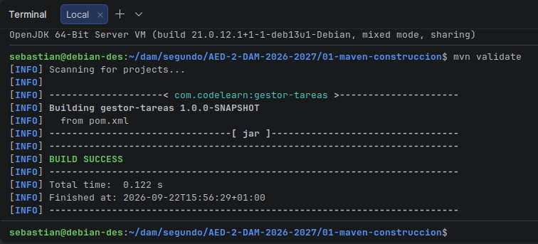

<hr>

## 04 - Compilar y entender archivos
Empecemos a compilar el proyecto con `mvn compile`, esto debería imprimir el siguiente mensaje por consola:

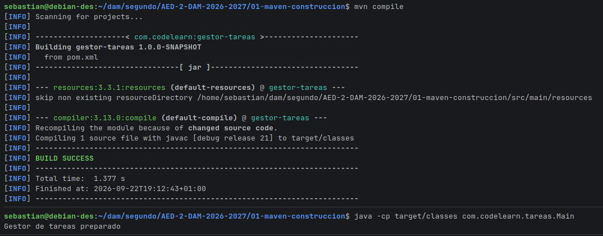

Tras ello localizamos las clases con `find target/classes -type f` y comprobamos que todo funcione.

Como se menciona en la práctica `mvn clean` elimina la carpeta `target`

<hr>

## 05 - Ciclos de vida, fases y goals
### Identificar entorno
Usamos los comandos para discernir nuestro usuario y versiones de Java Y Maven.

```bash
whoami
pwd
java -version
javac -version
mvn -version
echo "$JAVA_HOME"
echo "$PATH"
```

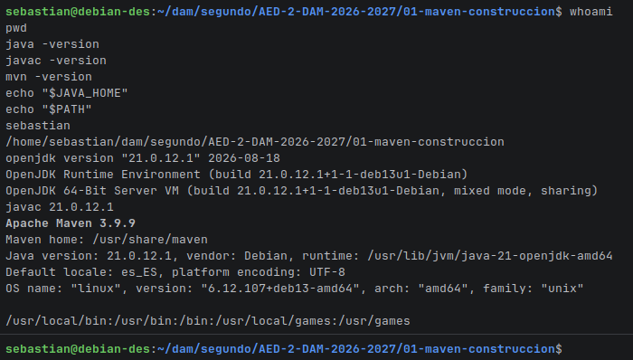

NOTA: Tras mucho intentarlo no encontré manera de instalar el Java 17. Por eso saltaré este paso

Aún así, suponiendo que tuviera Java 17 instalado el build de Maven no funcionaría porque en el `pom.xml` se exige que la versión de Java sea la 21.

La ejecución de `find target -maxdepth 2 -type f | sort` sí devuelve lo que debería:

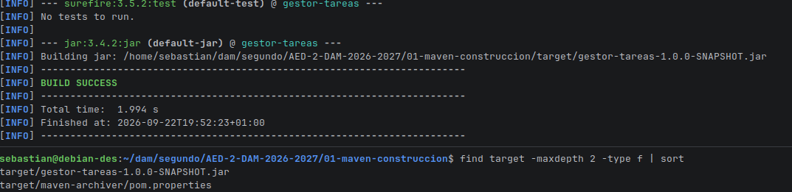

<hr>

## 06 - Añadir y utilizar una dependencia

Editamos el `pom.xml` por primera vez para agregar una dependencia, para ver su correcto funcionamiento editamos también el `Main.java`

Como resultado debería aparecer el siguiente mensaje:

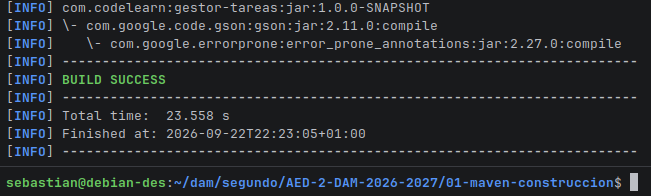

<hr>

## 07 - Maven central y repo local

Tras insertar el dependency del anterior ejercicio podemos ver cómo se han creado unas carpetas siguiendo las etiquetas del XML, donde `groupId`, `artifactId` y `version` son ahora directorios.

También se debe recalcar que de esta forma, con `mvn install` copias tu proyecto a tu propio repo, por eso nadie más puede verlo.

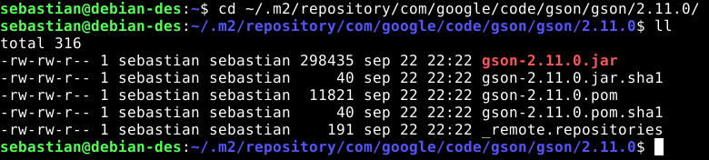

<hr>

## 08 - Repositorios externos y settings.xml

Tras seguir con los ejercicios, pasamos a crear una carpeta config, que será como un perfil con configuraciones de entorno.

Notable en este apartado que con `-P`, el perfil se activa y Maven añade el repositorio central-explicito a su lista de repos. Sin `-P`, el archivo se carga pero el perfil está inactivo, así que ese repo no existe para Maven.

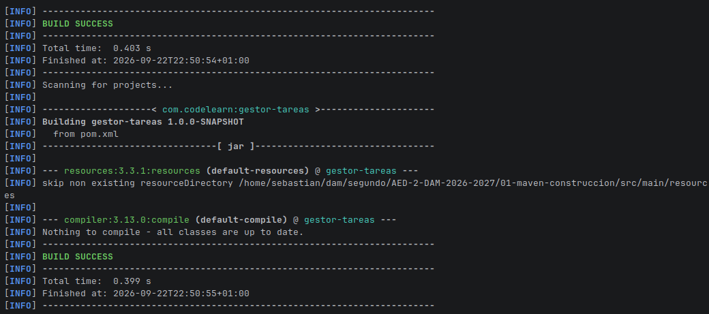

<hr>

## 09 - Repositorios privados, mirrors y proxy
Como no tengo una cuenta autorizada y un Nexus o un Artifactory dejaré este ejercicio como un análisis.

Mirror: empresa. URL: https://repo.empresa.example/repository/maven-public/ (sin servicio disponible).
`mirrorOf=*` redirige todas las peticiones al mirror. Las credenciales se asocian porque el `<server><id>` coincide con el `<mirror><id>`, y se leen de las variables de entorno `MAVEN_REPO_USER` y `MAVEN_REPO_TOKEN`, así no hay secretos en el archivo.

<hr>

## 10 - Profiles: activar configuraciones de Maven

En este apartado aprendemos a activar perfiles que ya sabíamos crear en el apartado 08.

Primero insertamos el fragmento de activación en el profile "informe"
```xml
<id>informe</id>
  <activation>
    <property>
      <name>informe</name>
      <value>true</value>
    </property>
  </activation>
```
Justo debajo del id, de esta forma podremos activarlo con `mvn -Dinforme=true help:active-profiles`

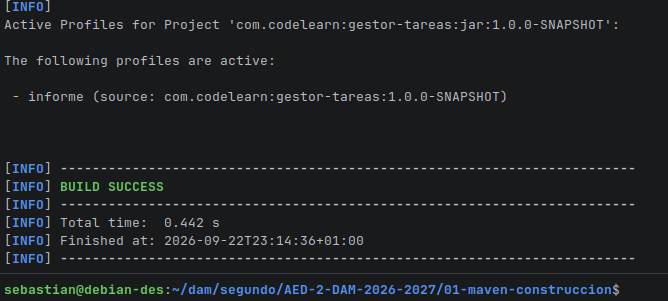

<hr>

## 11 - Dependencias transitivas, scopes y conflictos

Ahora aprendemos a "manejar" o más bien entender conflictos entre scopes de maven. En la imagen vemos cómo silencio un aviso del `commons-lang3` con el exclusions en el pom.xml y la salida al ejecutar `mvn dependency:tree -Dverbose -Dincludes=org.apache.commons`

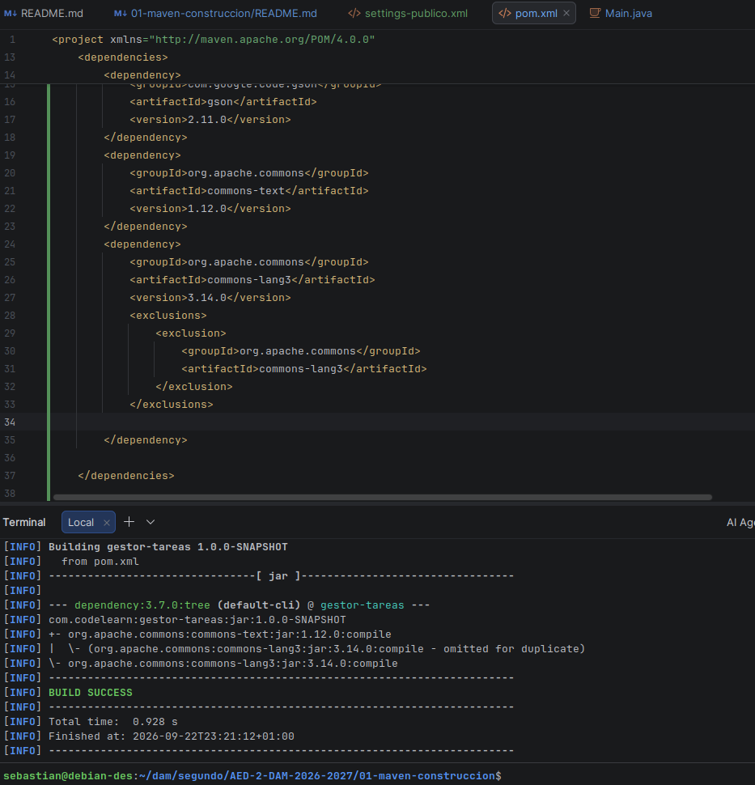

<hr>

## 12 - Propiedades y gestión de versiones

En este apartado aprenderemos a usar las propiedades para que el gestión de versiones sea más ameno. Añadiendo a `<properties>` las versiones de los plugins nos ahorraremos tener que viajar por todo el XML para cambiar una versión (siempre que usemos ${XXX.version} en donde corresponde).

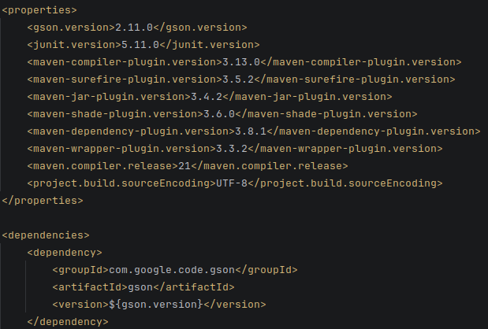


<hr>

## 13 - Añadir y ejecutar pruebas con JUnit

Entramos en la creación de tests, esta parte creamos una clase sencilla y un test para probarla. En este caso los tests deben probar que el programa trabaja con `null` y que las listas devuelven copias no alterables. Estos fueron los tests que hice con ese propósito:
```java
@Test
void rechazaTituloNull() {
    var gestor = new GestorTareas();
    assertThrows(IllegalArgumentException.class, () -> gestor.anadir(null));
}

@Test
void listarNoPermiteModificarEstadoInterno() {
    var gestor = new GestorTareas();
    gestor.anadir("Aprender Maven");
    List<String> lista = gestor.listar();
    assertThrows(UnsupportedOperationException.class, () -> lista.add("Aprendido"));
}
```

Y aquí la prueba de que todo pasa:

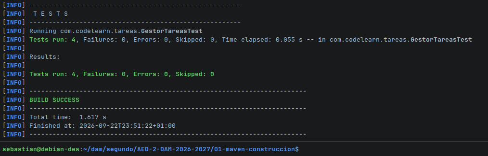

<hr>

## 14 - El build como comprobación de calidad

El build ya asegura que ciertos errores no se han cometido, por ejemplo, la falta de la versión en la dependencia de JUnit, provocaba un error de compilación.

Por otro lado tenemos el error controlado de eliminar `titulos.add(titulo);` que provoca un error de aserción como muestra la imagen:

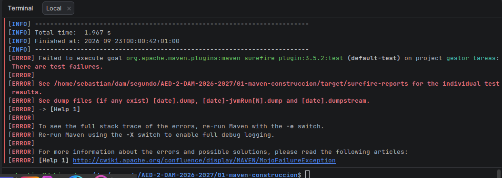


<hr>

## 15 - Recursos y configuración de la aplicación

Primer contacto con un `.properties` que usaremos para asignar un nombre. También vemos su aparición cuando usamos el comando `jar tf target/gestor-tareas-1.0.0-SNAPSHOT.jar`.

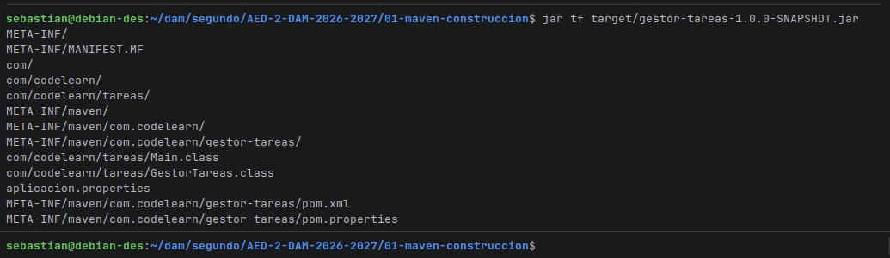

<hr>


## 16 -  Empaquetar y ejecutar la aplicación

Ha llegado la hora de empaquetar todo y ejecutar, siguiendo los pasos de mi terminal he logrado ejecutarlo fuera del proyecto (en el escritorio)

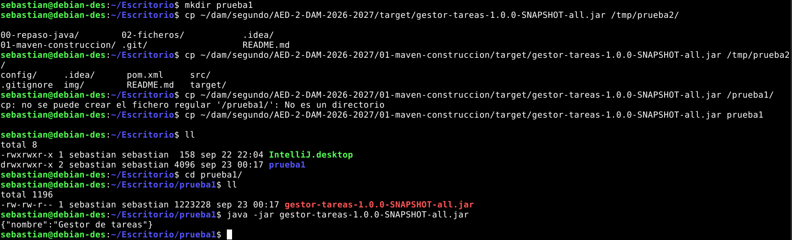

<hr>

## 17 - Crear y utilizar Maven Wrapper

Un wrapper en escencia es un plugin que descargará la distribución pertinente en su primer uso.

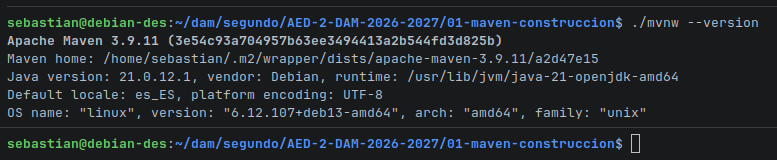

Aquí vemos como lo que el wrapper controla es la versión de Maven, ya que comparandola con `mvn -version` hay una diferencia de versión. Lo que no controla son elementos como el **JDK**, la red y el sistema operativo.

Es decir que el wrapper controla qué Maven se ejecuta pero no en qué entorno lo hace.

<hr>

# Conclusión final

## Problemas encontrados
- Durante la configuración de la máquina virtual me topé con barreras como arreglar los permisos de usuario, que gracias a los conocimientos del año pasado pude resolver de la manera adecuada con `su` y editando el archivo `sudoers` en la ruta `/etc/sudoers`


- No pude instalar la versión de Java 17 para el ejercicio, aunque investigué al respecto no tuve tiempo suficiente para solucionarlo. Como el objetivo de instalar Java 17 era el de entender qué papel desempeña el `pom.xml` en el fijado de las versiones, considero que aprendí lo que tenía que aprender.
**NOTA**: Pude solucionarlo, el problema era el `javac`, que al parecer no tenía ninguno instalado estaba dando problemas, pero me di cuenta muy tarde para llevarlo a cabo y sacar capturas (falta de tiempo).


- En el ejercicio 13, en la página de Code Learn Academy, se nos da la dependencia del JUnit lista para pegar en el pom.xml, pero justo en el anterior ejercicio vimos cómo manejar versiones de dependencias y este fragmento carece de una, lo cual da error al compilar:
```xml
<dependency>
  <groupId>org.junit.jupiter</groupId>
  <artifactId>junit-jupiter</artifactId>
  <version>${junit.version}</version> <!--Esto no estaba-->
  <scope>test</scope>
</dependency>

```

> Sebastián Laya González | slayaglez